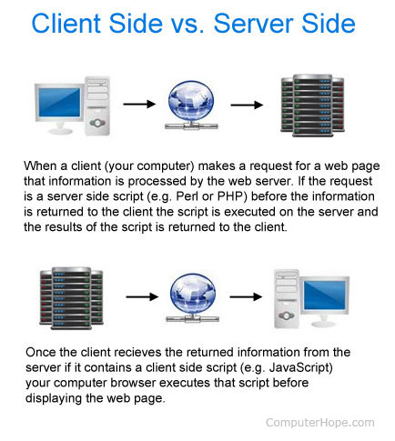

# What is Script?
> + Script is lightweight or loosely typed programming language

### what is the **Loosely Typed**?
> + It means some of the things are not mandatory here.
> + For ex,\
a] you can open single quotation close single quotation\
b]Everytime semicolon not required.

## What is the scripting language?
> + A scripting or script language is a programming language that automates the execution of tasks; the tasks could alternatively be executed one-by-one by a human operator. 
> + Scripting languages are often interpreted, rather than compiled. 

## Advantags of scripting:
> + Easy to learn and use.
> + Minimum programming knowledge and experience required.
> + Allow the tasks to be performed in relatively few steps.
> + Allow simple creation and editing in the variety of text editors.
> + Allow the addition of dynamic and interactive activities to the web pages.
> + Editing and running the code is fast.

## Disadvantages of scripting:
> + As code exeeutes on the users computer,in some cases it may be get exploited for malicious purposes.
> + Not always  able to work across the different browsers.

## Types of scripts:

**Client side scripts**
> + The script which is running on the browser,is known as client side scripting.
> + Client-side scripting requires browsers to run the scripts on the client machine but does not interact with the server while processing the client-side scripts.
Example: javscript,Jquery angular js

**server side scripts**
> + The script which is running within the server,is known as server side scripting.
> + The server side scripting involves server for its processing. 
> + Example:Tomcat,Apache,W3c->jigsaw server.
  
> 
## What is the difference  between scripting and programming languages?
> + scripting language is interpreted(reads line by line)\
Programming languages are compiler based.

> + Implicit declaration of the datatypes in scriptng language\
Var x=100;\
Var str=”Neha”;\
Var y=100.00;\
In scripting languages,there is no need to declare as int,char,float etc.

> + Limited support for the aplication development in scripting language.\
Scripts are not that much strong to develope every feature.\
In that case programming language is more powerful.

> + Limited support for game developement in scripting languages..

> + Scripting languages can easily integrate with the other technologies.

> + Generally, compiled programs run faster than interpreted programs because they are first converted into native machine code.

> + Scripting languages are mainly used for the day-to-day tasks while the programming ones - for the development of the complex systems and applications.
 
> + An interpreted language is a type of programming language for which most of its implementations execute instructions directly and freely, without previously compiling a program into machine-language instructions.
