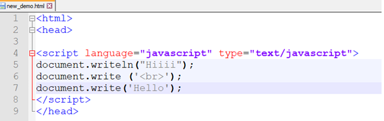

# JavaScript - Syntax

> + JavaScript can be implemented using JavaScript statements that are placed within the **< script>... < /script>** HTML tags in a web page.
> + The < script> tag alerts the browser program to start interpreting all the text between these tags as a script.
> +  A simple syntax of your JavaScript will appear as follows.

> + < script ...>\
>    JavaScript code\
> < /script>

The script tag takes two important attributes −
> + **Language** \
>  This attribute specifies what scripting language you are using. Typically, its value will be javascript.
> + **Type**\
> It indicates the scripting language in use and its value should be set to "text/javascript".

So your JavaScript segment will look like −
>  < script language = "javascript" type = "text/javascript">\
>    JavaScript code\
> < /script>

## document.write
> we call a function document.write which writes a string into our HTML document.
> + document is an object write is a method.

> 
OUTPUT:\
> 

> + You can give single quotes also 
> + Here I am giving writeln
ln means giving a space in between the 2 lines

> 

> 

> + Now If You want to give the second sentence on a next line
Then ,you can use < pre> tag Prformatted text
> + The output will  display in the 2 lines

> 

> + If I don’t want to us pre tag but I want to seperate the 2 lines then u can also use the< br >tag.

> 

> + But it does not give any of the output .The reason behind this is that,tags can not be directly use in the script area
> + Tag is from the html
So there is 1 syntax rule:

>  
 
> Now I want to give heading , change a font
and also give the font size ino it.

>  

>  

> + Now here we are saving it with the .html or.htm extension
and not by .js .Bcz, .js does not contain any tag related things
> + Js file contains only javascript means here only document.write
> + As here the tags are valuable so savd it as a .html or .htm extension.

