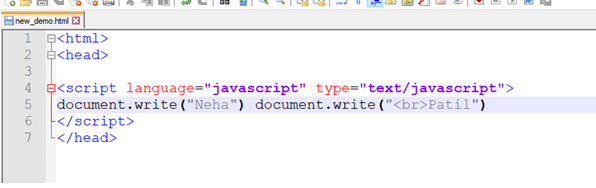
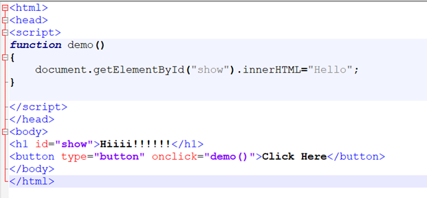
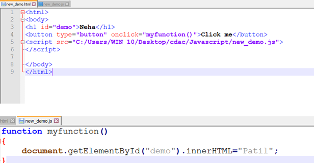
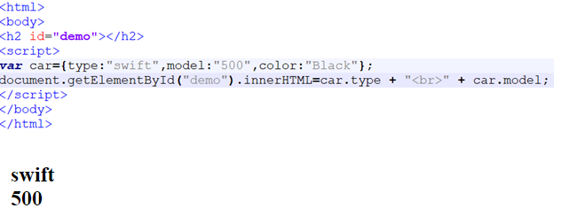
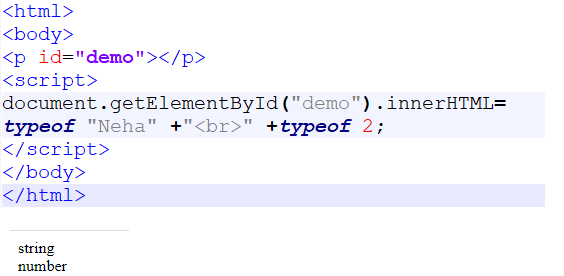

## Semicolons are Optional
> + In programming language every single statement ends with a  semicolon
> + But in the scripting language it is not a compulsory
> + It is get executed with or without semicolon also
> + Then why we give the semicolon here?
> + Bcz,If I write like this

> 

> + Then it will not give any thing in the output
But If I give semicolon here it will give the proper output.

## Comments in JavaScript
 < script language = "javascript" type = "text/javascript">\
      // This is a comment. 
   
      /*
       This is a multi-line comment in JavaScript
       It is very similar to comments in C Programming
      */
   
 /script>

# JavaScript Where To

> + JavaScript in < head> or < body>
You can place any number of scripts in an HTML document.
> + Scripts can be placed in the < body>, or in the < head> section of an HTML page, or in both.

**JavaScript in < head>**
> + In this example, a JavaScript function is placed in the < head> section of an HTML page.
The function is invoked (called) when a button is clicked:

> 

> 

**JavaScript in < body>**
> + In this example, a JavaScript function is placed in the < body> section of an HTML page.
The function is invoked (called) when a button is clicked.

**External JavaScript**
> + Scripts can also be placed in external files:

> 

**External JavaScript Advantages**\
> Placing scripts in external files has some advantages:
> + It separates HTML and code
> + It makes HTML and JavaScript easier to read and maintain
> + Cached JavaScript files can speed up page loads

**Real Life Objects, Properties, and Methods**\
> + In real life, a car is an object.
> + A car has properties like weight and color, and methods like start and stop:
> + All cars have the same properties, but the property values differ from car to car.
> + All cars have the same methods, but the methods are performed at different times.
> + Objects are variables too. But objects can contain many values.
> + This code assigns many values (Fiat, 500, white) to a variable named car:

> 

# JavaScript Functions

> + A JavaScript function is a block of code designed to perform a particular task.
> + A JavaScript function is executed when "something" invokes it (calls it).
> + JavaScript Function Syntax
> + function name(parameter1, parameter2, parameter3) {
  // code to be executed
}

# The typeof Operator
> + You can use the JavaScript typeof operator to find the type of a JavaScript variable.
> + The typeof operator returns the type of a variable or an expression:

> 
