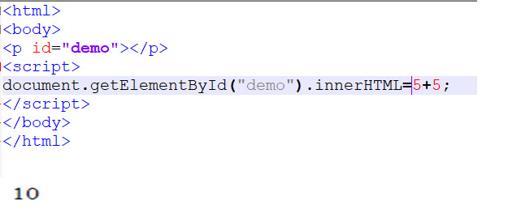
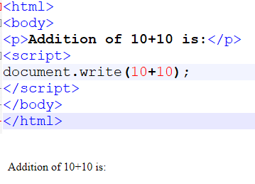
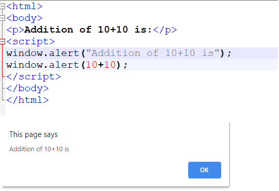
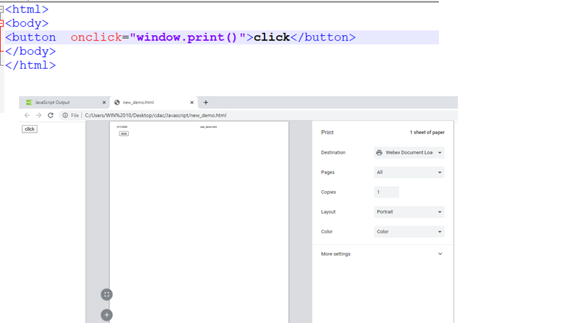

# JavaScript Output

**Using innerHTML**
> + To access an HTML element, JavaScript can use the document.getElementById(id) method.
> + The id attribute defines the HTML element. The innerHTML property defines the HTML content:

> 

**Using document.write()**
> + For testing purposes, it is convenient to use document.write():
> + Using document.write() after an HTML document is loaded, will delete all existing HTML:

> 

**Using window.alert()**
> + You can use an alert box to display data:

> 

**JavaScript Print**
> + JavaScript does not have any print object or print methods.
> + You cannot access output devices from JavaScript.
> + The only exception is that you can call the window.print() method in the browser to print the content of the current window.

> 
